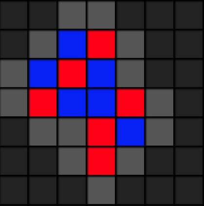
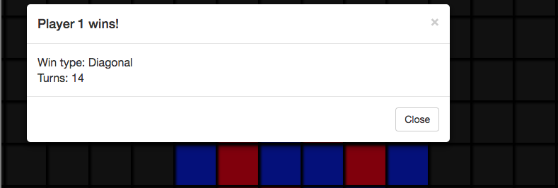

# [Abra, the Strategy Game](https://jacobjanak.github.io/Abra/)

Play against the computer or a friend in a game that's like Tic-Tac-Toe... but harder.

Connect 5 squares in a row to win! The boundaries are endless, making a tie impossible. 

